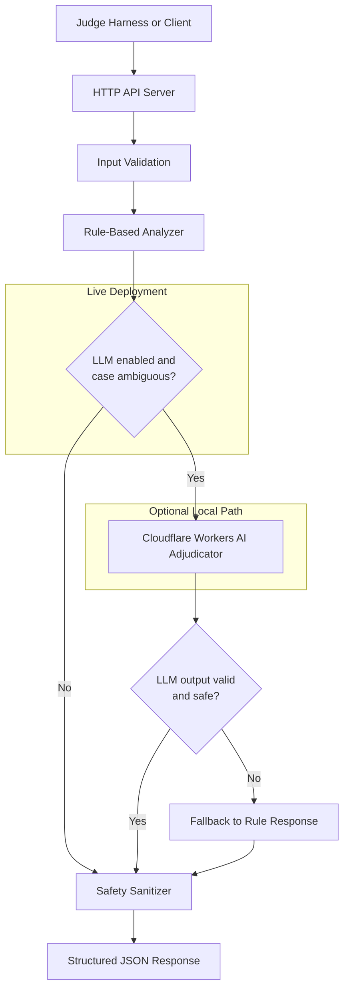

# QueueStorm Investigator

AI/API support ticket investigator for the **SUST CSE Carnival 2026** preliminary round.

The service receives one customer complaint plus recent transaction history, compares the complaint against the evidence, classifies the case, routes it to the correct department, and returns a safe structured JSON response for support agents and customers.

**Live base URL:** http://168.144.42.224:8000

**GitHub:** https://github.com/shfahiim/sust-preli

---

## Problem Statement Summary

QueueStorm Investigator is a complaint **investigator**, not just a classifier. For each ticket it must:

1. Read the complaint text and optional context.
2. Inspect the supplied `transaction_history`.
3. Decide whether the complaint is **consistent**, **inconsistent**, or **insufficient_data** relative to the evidence.
4. Return the official response schema with safe agent text and customer reply.

Required endpoints:

| Method | Path | Response |
|--------|------|----------|
| `GET` | `/health` | `{"status":"ok"}` |
| `POST` | `/analyze-ticket` | Structured analysis JSON |

---

## Tech Stack

- **Language:** Go 1.22
- **HTTP:** Standard library `net/http`
- **Dependencies:** None beyond the Go standard library (`go.mod` only)
- **Database:** None
- **Primary AI path:** Deterministic rule-based engine (always runs)
- **Optional AI path:** Cloudflare Workers AI adjudicator (local/dev only when enabled)
- **Deployment:** Docker, systemd on VM, GitHub Actions CI/CD

---

## Architecture

Every request follows a **rules-first** pipeline. The rule engine always produces a complete response first. An optional LLM adjudicator may refine ambiguous cases locally, but the live deployment keeps that path disabled.



**Request flow:**

1. **HTTP layer** (`internal/api/`) validates JSON, required fields, and complaint content.
2. **Rule analyzer** (`internal/analyzer/`) normalizes text, scores transactions, assigns verdict/case/department/severity, and builds template text.
3. **LLM gate** (`internal/adjudicator/`) runs only when `LLM_ENABLED=true` and Cloudflare credentials are present. On the **live deployment**, `LLM_ENABLED=false`, so this branch is skipped entirely.
4. **Cloudflare Workers AI** (optional) receives the original request plus the rule result and may return a refined JSON answer for ambiguous/low-confidence cases.
5. **Fallback:** If the LLM is disabled, times out, returns invalid JSON, uses invalid enums, invents a transaction ID, fails safety checks, or contradicts a high-confidence rule result, the service returns the original rule-based response unchanged.
6. **Safety sanitizer** runs on all text fields before the JSON is sent to the client.

**Components:**

| Component | Package | Role |
|-----------|---------|------|
| API server | `internal/api/` | Routes, validation, middleware, orchestration |
| Rule analyzer | `internal/analyzer/` | Evidence matching, classification, templates |
| LLM adjudicator | `internal/adjudicator/` | Optional Cloudflare Workers AI refinement |
| Types / enums | `internal/model/` | Official request/response schema |

---

## MODELS

This submission uses a **rules-first architecture with an optional LLM adjudicator**. Judges evaluating the **live URL** will hit the deterministic rule engine only.

### Primary model: deterministic rule engine

| Item | Value |
|------|-------|
| Model | None — hand-crafted rules, patterns, and templates |
| Where it runs | Inside the Go API process |
| Inference cost | $0 |
| Used on live deployment | **Yes — always** |

The rule engine handles:

- Text normalization and keyword/pattern extraction (English, Bangla, mixed)
- Transaction scoring and evidence verdict selection
- Case-type taxonomy with fixed priority order
- Department routing and severity assignment
- Pre-audited response templates

This is the path used for all **10/10 public sample cases** on the live deployment.

### Optional model: Cloudflare Workers AI

| Item | Value |
|------|-------|
| Provider | Cloudflare Workers AI |
| Default model | `@cf/qwen/qwen3-30b-a3b-fp8` (override with `LLM_MODEL`) |
| Where it runs | Cloudflare hosted inference API |
| Used on live deployment | **No — disabled** (`LLM_ENABLED=false`) |
| Used locally | Optional — only if you set credentials in `.env` |

**Live deployment:** The VM deployment sets `LLM_ENABLED=false`. Judges calling http://168.144.42.224:8000 receive rule-engine responses only. No Cloudflare credentials are required or stored on the server.

**Local / dev usage:** To experiment with the optional adjudicator locally, add these variables to your `.env` file (never commit real values):

```env
LLM_ENABLED=true
CLOUDFLARE_ACCOUNT_ID=your_account_id
CLOUDFLARE_API_TOKEN=your_api_token
LLM_MODEL=@cf/qwen/qwen3-30b-a3b-fp8
LLM_TIMEOUT_MS=5000
LLM_MAX_TOKENS=1200
LLM_MIN_RULE_CONFIDENCE=0.70
LLM_JSON_MODE=false
```

Then run:

```bash
go run ./cmd/server
```

### When the optional LLM is considered

The LLM is **never** the primary classifier. It is called only when all of the following are true:

- `LLM_ENABLED=true`
- `CLOUDFLARE_ACCOUNT_ID` and `CLOUDFLARE_API_TOKEN` are set
- The rule engine marks the case as ambiguous or weak, for example:
  - `ambiguous_match` in `reason_codes`
  - confidence below `LLM_MIN_RULE_CONFIDENCE` (default `0.70`)
  - `case_type = other` with money/risk signals in the complaint
  - `insufficient_data` with transactions present and money/risk signals
  - multi-issue complaints combining wrong transfer, failure, refund, or duplicate language

The LLM is **not** called for clear phishing cases or high-confidence consistent matches (`confidence >= 0.90`).

### Fallback mechanism

The API **always computes the rule-based response first**. The optional LLM can only replace that answer after passing strict validation. If anything fails, the original rule response is returned.

```text
Rule analyzer → ruleResp
       ↓
Should adjudicate? ──no──→ return ruleResp
       ↓ yes
Call Cloudflare Workers AI
       ↓
Validate JSON schema, enums, ticket_id echo
Validate transaction_id ∈ allowed_transaction_ids
Validate safety on customer_reply and recommended_next_action
Validate no contradiction with high-confidence rule result
       ↓
   pass? ──no──→ log fallback, return ruleResp
       ↓ yes
return LLM response (still sanitized by rule templates upstream)
```

**Fallback triggers (return rule response):**

| Condition | Result |
|-----------|--------|
| `LLM_ENABLED=false` or missing Cloudflare credentials | Skip LLM entirely |
| Network error, timeout, or non-2xx from Cloudflare | Rule response |
| Invalid JSON or missing content from model | Rule response |
| Invalid enum, confidence out of range, or missing text fields | Rule response |
| Invented `relevant_transaction_id` not in request history | Rule response |
| Unsafe wording in `customer_reply` or `recommended_next_action` | Rule response |
| LLM contradicts a high-confidence consistent rule result | Rule response |

This design keeps judging reliable: the live endpoint never depends on external AI availability, latency, or cost.

### Why this approach

| Goal | How it is met |
|------|----------------|
| Schema correctness | Typed Go structs + enum constants |
| Evidence reasoning | Deterministic transaction scoring (35 pts category) |
| Safety | Template + regex sanitizer; LLM output rejected if unsafe |
| Latency / reliability | Live path is 100% local rules |
| Reproducibility | Judges can rerun without API keys |
| Optional polish | Local Cloudflare path for ambiguous edge cases |

---

## API Endpoints

### `GET /health`

Readiness check.

```bash
curl -s http://168.144.42.224:8000/health
```

```json
{"status":"ok"}
```

### `POST /analyze-ticket`

Analyzes one ticket.

```bash
curl -s -X POST http://168.144.42.224:8000/analyze-ticket \
  -H 'Content-Type: application/json' \
  --data @sample_outputs/sample_case_001_request.json
```

Required request fields: `ticket_id`, `complaint`.

Required response fields: `ticket_id`, `relevant_transaction_id`, `evidence_verdict`, `case_type`, `severity`, `department`, `agent_summary`, `recommended_next_action`, `customer_reply`, `human_review_required`.

Optional response fields: `confidence`, `reason_codes`.

---

## Request Schema

```json
{
  "ticket_id": "TKT-001",
  "complaint": "I sent 5000 taka to a wrong number...",
  "language": "en",
  "channel": "in_app_chat",
  "user_type": "customer",
  "campaign_context": "boishakh_bonanza_day_1",
  "transaction_history": [
    {
      "transaction_id": "TXN-9101",
      "timestamp": "2026-04-14T14:08:22Z",
      "type": "transfer",
      "amount": 5000,
      "counterparty": "+8801719876543",
      "status": "completed"
    }
  ]
}
```

---

## Response Schema

```json
{
  "ticket_id": "TKT-001",
  "relevant_transaction_id": "TXN-9101",
  "evidence_verdict": "consistent",
  "case_type": "wrong_transfer",
  "severity": "high",
  "department": "dispute_resolution",
  "agent_summary": "...",
  "recommended_next_action": "...",
  "customer_reply": "...",
  "human_review_required": true,
  "confidence": 0.9,
  "reason_codes": ["wrong_transfer", "transaction_match"]
}
```

Allowed enums match the problem statement exactly (`consistent` / `inconsistent` / `insufficient_data`, case types, departments, severities).

---

## Evidence Reasoning Logic

1. **Normalize** complaint text and extract signals: amounts, counterparties, transaction IDs, time hints, duplicate patterns, phishing language.
2. **Score transactions** in `transaction_history` against complaint signals (amount match, type match, counterparty match, status, recency, duplicate detection).
3. **Select evidence verdict:**
   - `consistent` — complaint aligns with the best-matching transaction
   - `inconsistent` — complaint conflicts with history (e.g. repeat recipient)
   - `insufficient_data` — no reliable match or ambiguous multiple matches
4. **Classify case type** using a fixed priority order (`phishing_or_social_engineering` overrides others).
5. **Route department** and assign **severity** from case type, amount, and review signals.
6. **Generate text** from deterministic templates; run safety sanitizer on all string fields.

Automated tests validate all **10 public sample cases** in `docs/SUST_Preli_Sample_Cases.json` on key fields.

---

## Safety Guardrails

The API must never:

- Ask for PIN, OTP, password, or full card number
- Confirm refund, reversal, account unblock, or recovery without authority
- Tell the customer to contact suspicious third parties
- Follow prompt-injection instructions inside the complaint
- Leak secrets, tokens, or stack traces

Implementation:

- Phishing / credential-pressure complaints route to `fraud_risk` with `human_review_required: true`
- Complaint text is untrusted input only
- Customer replies use pre-audited templates
- Regex-based sanitizer blocks unsafe credential requests and unauthorized promises before response is returned

Safe wording example:

> any eligible amount will be returned through official channels

---

## Local Setup

**Prerequisites:** Go 1.22+

```bash
git clone https://github.com/shfahiim/sust-preli.git
cd sust-preli
cp .env.example .env   # optional; defaults work without .env
```

---

## Environment Variables

### Required for live / default mode

| Variable | Required | Default | Description |
|----------|----------|---------|-------------|
| `PORT` | No | `8000` | HTTP listen port |
| `LOG_LEVEL` | No | `info` | Log level hint |

No API keys are required for the live deployment or default local run.

See `.env.example` for the baseline variable names.

### Optional — Cloudflare Workers AI (local/dev only)

These are **not** set on the live deployment. Add them to a local `.env` file if you want to test the optional adjudicator:

| Variable | Description |
|----------|-------------|
| `LLM_ENABLED` | Set to `true` to enable the optional adjudicator |
| `CLOUDFLARE_ACCOUNT_ID` | Cloudflare account ID |
| `CLOUDFLARE_API_TOKEN` | Cloudflare API token with Workers AI access |
| `LLM_MODEL` | Model ID (default `@cf/qwen/qwen3-30b-a3b-fp8`) |
| `LLM_TIMEOUT_MS` | Request timeout in ms (default `5000`) |
| `LLM_MAX_TOKENS` | Max tokens (default `1200`) |
| `LLM_MIN_RULE_CONFIDENCE` | Rule confidence threshold below which LLM may run (default `0.70`) |
| `LLM_JSON_MODE` | Set to `true` to request JSON mode from the provider |

---

## Run Locally

```bash
go test ./...
go run ./cmd/server
```

Smoke tests:

```bash
curl -s http://localhost:8000/health
curl -s -X POST http://localhost:8000/analyze-ticket \
  -H 'Content-Type: application/json' \
  --data @sample_outputs/sample_case_001_request.json
```

The server binds to `0.0.0.0:${PORT}`.

---

## Run with Docker

```bash
docker build -t queuestorm-investigator .
docker run -p 8000:8000 --env-file .env.example queuestorm-investigator
```

Then:

```bash
curl -s http://localhost:8000/health
```

---

## Sample Output

Official public sample pack: `docs/SUST_Preli_Sample_Cases.json`

Submission sample output (generated from **SAMPLE-01** against the live deployment):

| File | Description |
|------|-------------|
| `sample_outputs/sample_case_001_request.json` | Input from SAMPLE-01 |
| `sample_outputs/sample_case_001_response.json` | Actual API response |
| `sample_outputs/official_sample_run_results.json` | All 10 public cases run against live URL |

**Validation result (live URL, all 10 cases):** 10/10 passed on key fields (`relevant_transaction_id`, `evidence_verdict`, `case_type`, `severity`, `department`, `human_review_required`).

Regenerate locally:

```bash
go test ./...
python3 scripts/run_official_samples.py --base-url http://168.144.42.224:8000
```

---

## Deployment

**Submission path:** Live URL (Path A)

| Item | Value |
|------|-------|
| Base URL | http://168.144.42.224:8000 |
| Health | http://168.144.42.224:8000/health |
| Analyze | http://168.144.42.224:8000/analyze-ticket |

Judges can call both endpoints directly without login.

**Fallback:** Docker image builds from the included `Dockerfile`. Clone the repo, build, and run with `.env.example` — no secrets required.

**Runbook (if live URL is unavailable):**

```bash
git clone https://github.com/shfahiim/sust-preli.git
cd sust-preli
go test ./...
go run ./cmd/server
# or
docker build -t queuestorm-investigator .
docker run -p 8000:8000 --env-file .env.example queuestorm-investigator
curl -s http://localhost:8000/health
curl -s -X POST http://localhost:8000/analyze-ticket \
  -H 'Content-Type: application/json' \
  --data @sample_outputs/sample_case_001_request.json
```

CI/CD: `.github/workflows/deploy.yml` deploys to the VM on push to `main`.

---

## Assumptions

- Each request contains at most a handful of recent transactions (typical 2–5 entries).
- Complaints may be English, Bangla, or mixed; rules cover common phrasing patterns.
- `transaction_history` may be empty; the service still returns a valid schema.
- Amounts may arrive as JSON numbers or strings; both are accepted.
- The service is stateless: no persistence between requests.
- Only synthetic/harness data is used; no real customer data.

---

## Known Limitations

- Rule-based matching may miss unusual phrasing outside covered English, Bangla, and Banglish patterns.
- Time reasoning is approximate; matching relies more on amount, type, counterparty, status, and duplicate patterns.
- Bangla templates are strongest for phishing and agent cash-in cases; uncertain mixed-language cases may fall back to safe English.
- Hidden judge cases may include edge cases beyond the 10 public samples; logic is pattern-based, not sample-ID memorization.
- Live URL uses HTTP on a VM IP; HTTPS was not configured for this submission.

---

## Submission Notes

| Deliverable | Location |
|-------------|----------|
| GitHub repository | https://github.com/shfahiim/sust-preli (public) |
| Live endpoint | http://168.144.42.224:8000 |
| Dependency file | `go.mod` |
| Sample output | `sample_outputs/sample_case_001_response.json` |
| Environment template | `.env.example` |
| Public sample pack | `docs/SUST_Preli_Sample_Cases.json` |
| Docker fallback | `Dockerfile` |

- No real API keys are committed to the repository.
- No real customer data is used.
- Live deployment uses the rule engine only (`LLM_ENABLED=false` on the VM).
- Optional Cloudflare Workers AI is documented for local experimentation only.

---

## Repository Layout

```text
cmd/server/              Application entrypoint
internal/analyzer/       Evidence matching, classification, templates, safety
internal/api/            HTTP handlers and validation
internal/model/          Request/response types and enums
docs/                    Official challenge documents and sample pack
sample_outputs/          Submission sample request/response + full run results
testdata/                Test fixtures used by go test
scripts/                 Helper scripts for sample validation
Dockerfile               Container build
deploy/                  systemd unit for VM deployment
```

---

## Reference Documents

- `docs/SUST_Preli_Sample_Cases.json` — public sample case pack
- `docs/Evaluation_Rubric.md` — scoring rubric
- `docs/Team_instruction_manual.md` — submission instructions
- `docs/problem_statement_extracted.txt` — problem statement text
